 ### Hello   👋

- 👨🏻‍💻 I'm WGG, a Front-end Software Engineer & AI Application Developer, fully embracing the AI era.
- 🌱 Building with Vue3 + TypeScript, and exploring AI-driven development with LLMs.
- 🌻 I'm currently working on Icon Edu Group.
- 🔭 Coding since 2018.
- ⚡ My hobbies are Coding, FPV ✈️, Guitar 🎸 and Fitness 🏃🏻‍♀️ (Welcome to follow my video: [BiliBili](https://b23.tv/F5Jsc5O) & [Tiktok](https://v.douyin.com/k8EE8cc/) & [Instagram](https://instagram.com/ssdwgg?igshid=YmMyMTA2M2Y=)).

 ### Get in touch

 
 

 
 
 
 

 ### Languages and Tools
           

 ## Buy Me A Coffee

